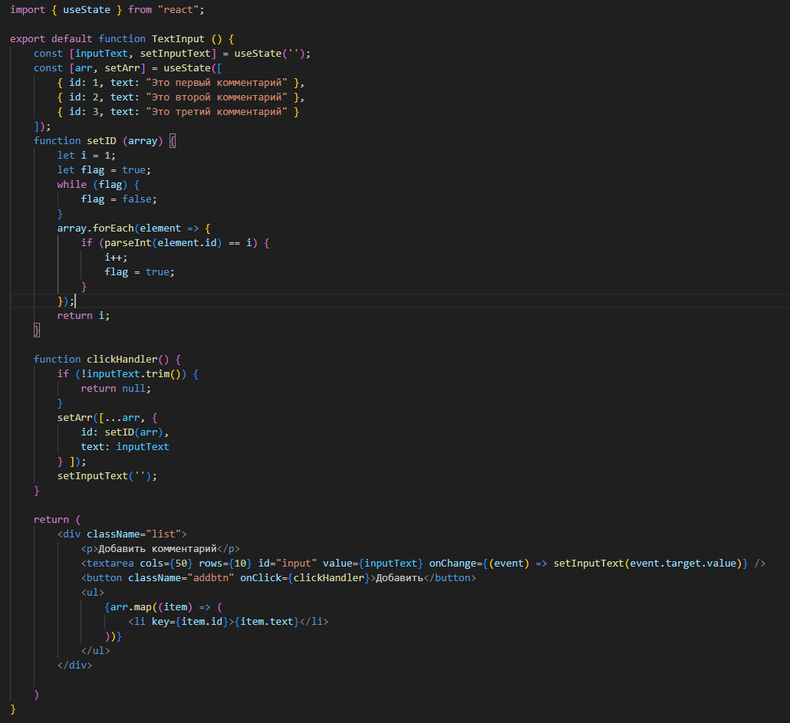
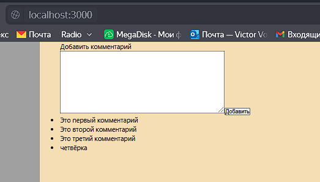
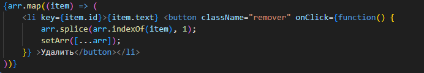
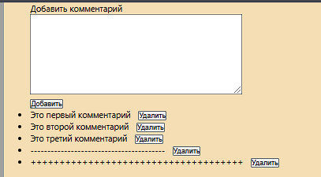
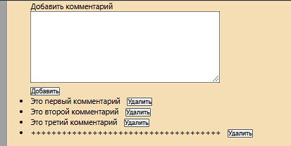

# Урок 2. State, Props. Жизненный цикл react компонента. Хуки #
Задание: Список комментариев с удалением.

Цель: Комбинирование useState, рендеринга списков и обработки событий для создания интерактивного интерфейса.

Задача:
Создать компонент CommentsList, который отображает список комментариев. Каждый комментарий должен иметь кнопку для его удаления. При нажатии на кнопку комментарий должен удаляться из списка.

За основу берём мод кода из видеоурока:

Добавляем в элемент < li > кнопку

### Результат: ###

Before:

After:

